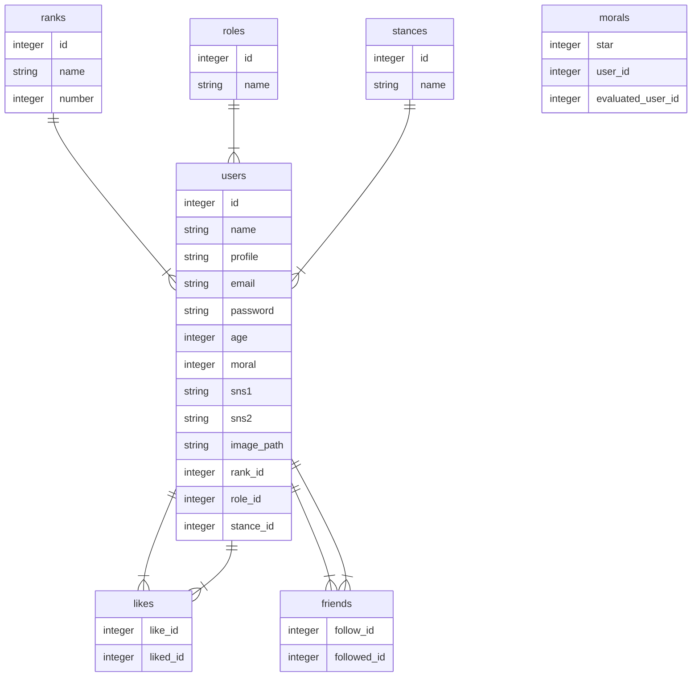

# VALOBOARD

## 概要
Varolantというゲームのユーザー同士のマッチングアプリ
## 制作背景

以前Varolantというゲームをしていた際に、暴言を吐くプレイヤーと当たってしまい、嫌な思いをした経験がありました。こういった嫌な思いをしている人は自分以外にも沢山いるのではないかと思い、マナーの良い穏やかな人とのみ繋がれるマッチングサービスを開発しました。
現時点では、複数条件で絞り込めるユーザー検索機能やユーザーに評価をつけて民度を可視化する機能が実装されています。

#### デプロイ先

https://valoboard1.herokuapp.com/

#### テストアカウント

アカウント名：太郎#0001
メールアドレス：aaa@gmail.com
パスワード：aaiiuueeoo

---

## 機能一覧

-   会員登録機能
-   マイページ編集
-   プレイヤー検索
-   他プレイヤーの評価

#### 展望

-   フレンド申請リスト

---

## 使用技術

#### フロントエンド

-   React
-   TailwindCSS

#### バックエンド

-   Laravel9

#### その他

-   Docker
-   MySQL
-   S3
---

## データベース

| テーブル名 |                                   説明                                    |
| :--------: | :-----------------------------------------------------------------------: |
|   users    |                             一般ユーザー情報                              |
|   ranks    | ユーザーのゲーム内ランクの情報 （ランクとはゲーム内の強さの指標である。） |
|   roles    |                 ユーザーの得意とするゲーム内の役割の情報                  |
|  stances   |                  ユーザーのゲームのプレイスタイルの情報                   |
|   morals   |                  ユーザーの他のユーザーからの評価の情報                   |
|   likes    |　　　　　　　　　　　ユーザーに対するお気に入りの情報　　　　　　　　　         |
|   firends  |　　　　　　　　　　　ユーザー友達になっているユーザーの情報　　　　　　　　　    |

- VALOBOARD

---

## 環境の立ち上げ方

このリポジトリをクローン後、下記の内容を実行
//valoboard で下記を実行

＄ sail up -d

4. マイグレーション
   //valoboard で下記を実行
   $ sail artisan migrate
   $ sail artisan db:seed

5. composer、node.js のインストール
   $ composer install
   $ npm install

6.ローカルでアプリケーションを起動
$ sail up -d
$ sail npm run dev
// localhost にアクセスするとプレビューが確認できる

#### docker の停止

// docker コンテナの停止
$ sail stop

// docker コンテナの削除
$ sail down

